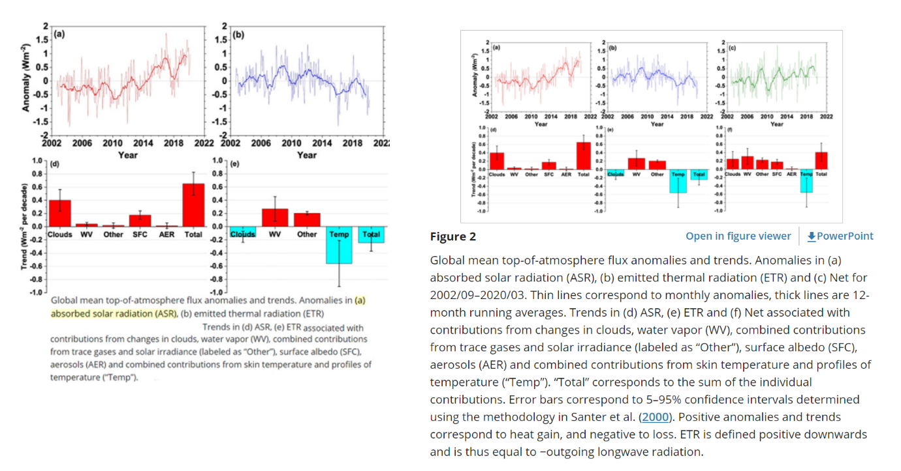

# Do Fewer Clouds Mean that Humans are not Contributing to Warming Temperatures?
*Article Reference*

Richard, K., 2021. 2001-2019 Warming Driven By Increases In Absorbed Solar Radiation, Not Human Emissions. *Watts Up With That*, [blog] 18 October. Available at: <https://wattsupwiththat.com/2021/10/20/2001-2019-warming-driven-by-increases-in-absorbed-solar-radiation-not-human-emissions/> [Accessed 23 October 2021].

This blog-style article argues that the warming of the global temperature seen between the years 2001 and 2019 is primarily a result of increased solar radiation absorption from a lack of cloud cover (decreased albedo) rather than any anthropogenic sources. The author makes use of four peer reviewed journal articles from various scientific journals, some well respected, and claims that the data published within them shows that human mediated climate forcings are of no concern and are not responsible for the warming temperatures. Obviously, this is an interesting argument to make as it goes against most of the published literature, which suggests that human activity is impacting the climate of the Earth. Furthermore, this article is an example of reporting only results that support the argument of the author - making it an excellent case study that highlights the importance of fact-checking information and referring to the primary literature. 

Even before researching this topic there was considerable concern regarding the level of bias and accuracy of the information reported in this blog. Before researching more into this topic I was able to discern a considerable level of bias from the author of the blog based on the tone of the writing and the manipulation of figures from the cited peer-reviewed papers. No information on the author besides a Twitter account with 5000 followers and a biography stating “climate science researcher” could be found - this account consistently posts papers that supposedly show there is no evidence of anthropogenic climate change. While the papers cited in this article come from peer-reviewed journals, the interpretation of the data by the author is incomplete. For example, the author cites a figure from Loeb et al. (2021), but removes the portion that disagrees with their claim (Figure 1).

*Figure 1*: Manipulated figure from Loeb et al., 2021 used in the article (left) versus the actual figure in the paper (right). The final set of graphs displaying the net effect of various climatic variables as well as several lines of the figure caption were cut out to better fit the narrative of the article. 

This flagrant manipulation of figures was not evident in any of the other cited works in the article, but calls into question the credibility of the author. However, through reading the other cited papers in the article, no other errors in data reporting were noticed (Dübal and Vahrenholt, 2021; Ollila, 2021; Delgado-Bonal et al., 2020). The claim that changes in cloud cover are more significant contributors to rising temperatures than greenhouse gasses in recent years contradicts the claims made by the IPCC and various authors (IPCC, 2021; Bonnet et al., 2021; Liguori et al., 2020; Touma et al., 2021). Nonetheless, it is not an outlandish claim as it is well known that the albedo of the Earth is a significant contributor to its temperature. Additionally, the argumentative structure of the article is fairly sound in claiming that less cloud cover results in more absorbed shortwave radiation, which results in increasing temperatures - although the impacts of other factors such as greenhouse gasses are conveniently excluded from mention.

### References

Bonnet, R., Swingedouw, D., Gastineau, G., Boucher, O., Deshayes, J., Hourdin, F., Mignot, J., Servonnat, J. and Sima, A., 2021. Increased risk of near term global warming due to a recent AMOC weakening. *Nature Communications*, 12(1), p.6108. https://doi.org/10.1038/s41467-021-26370-0.

Delgado-Bonal, A., Marshak, A., Yang, Y. and Holdaway, D., 2020. Analyzing changes in the complexity of climate in the last four decades using MERRA-2 radiation data. *Scientific Reports*, 10(1), p.922. https://doi.org/10.1038/s41598-020-57917-8.

Dübal, H.-R. and Vahrenholt, F., 2021. Radiative Energy Flux Variation from 2001–2020. *Atmosphere*, 12(10), p.1297. https://doi.org/10.3390/atmos12101297.

IPCC, 2021. *Climate Change 2021: The Physical Science Basis. Contribution of Working Group I to the Sixth Assessment Report of the Intergovernmental Panel on Climate Change*. Cambridge University Press.

Liguori, G., McGregor, S., Arblaster, J.M., Singh, M.S. and Meehl, G.A., 2020. A joint role for forced and internally-driven variability in the decadal modulation of global warming. *Nature Communications*, 11(1), p.3827. https://doi.org/10.1038/s41467-020-17683-7.

Loeb, N.G., Johnson, G.C., Thorsen, T.J., Lyman, J.M., Rose, F.G. and Kato, S., 2021. Satellite and Ocean Data Reveal Marked Increase in Earth’s Heating Rate. *Geophysical Research Letters*, 48(13), p.e2021GL093047. https://doi.org/10.1029/2021GL093047.

Ollila, A., 2021. Global Circulation Models (GCMs) Simulate the Current Temperature Only If the Shortwave Radiation Anomaly of the 2000s Has Been Omitted. *Current Journal of Applied Science and Technology*, pp.45–52. https://doi.org/10.9734/CJAST/2021/v40i1731433.

Touma, D., Stevenson, S., Lehner, F. and Coats, S., 2021. Human-driven greenhouse gas and aerosol emissions cause distinct regional impacts on extreme fire weather. *Nature Communications*, 12(1), p.212. https://doi.org/10.1038/s41467-020-20570-w.
